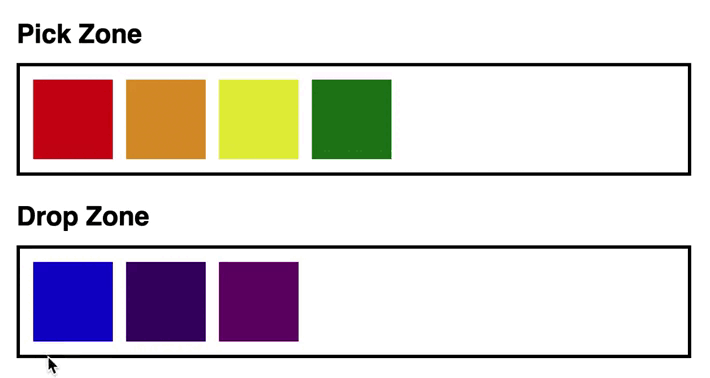

# Drag and Drop



This component allow users to drag and drop stuff with vanilla JavaScript.
## General Info
This project is not only for users that uses computer. It is also available for phone user since I am using Pointer Events API.
I also create a drop preview so users know where they’ll drop the element to.
Users can drop an element anywhere inside the dropzone.
## Technologies
A list of technologies used within the project:
- HTML
- CSS
- JavaScript

## Installation
A little intro about the installation. 
```
$ git@github.com:santtier/Drag-and-Drop.git
$ cd Drag-and-Drop.git
```

## Collaboration
Give instructions on how to collaborate with your project.
There are a set of rules to keep in mind:

- Perform work in a feature branch.
  _Why:_
  > Because this way all work is done in isolation on a dedicated branch rather than the main branch. It allows you to submit multiple pull requests without confusion. You can iterate without polluting the master branch with potentially unstable, unfinished code. [read more...](https://www.atlassian.com/git/tutorials/comparing-workflows#feature-branch-workflow)
- Branch out from `main`

  _Why:_

  > This way, you can make sure that code in master will almost always build without problems, and can be mostly used directly for releases (this might be overkill for some projects).

- Never push into `main` branch. Make a Pull Request.

  _Why:_

  > It notifies team members that they have completed a feature. It also enables easy peer-review of the code and dedicates forum for discussing the proposed feature.

- Delete local and remote feature branches after merging.
  _Why:_
  > It will clutter up your list of branches with dead branches. It ensures you only ever merge the branch back into (`main`) once. Feature branches should only exist while the work is still in progress.

- Comment your code. Try to make it as clear as possible.
- Don't use comments as an excuse for a bad code. Keep your code clean.
- Don't use clean code as an excuse to not comment at all.
- Keep comments relevant as your code evolves.
- Recommended using [JSDoc](https://www.youtube.com/watch?v=r0H-acWQS6c)

## FAQs
A frequently asked question:
**Why we do not use the Drag and Drop API?**
- You can build a Drag/Drop component with Drag and Drop API, but the Drag and Drop API is NOT the best technology for a Drag/Drop component.
The Drag and Drop API is built to mimic dragging and dropping on a desktop. It produces a ghost image when you drag the component.
Styling is limited for this ghost image since it’s not an HTML Element. You can [brute-force it with lots of hacks](https://kryogenix.org/code/browser/custom-drag-image.html "brute-force it with lots of hacks"). But even if you brute force it, you still can’t change things like **transform** or **opacity**!
So I cannot use the Drag and Drop API (which is unfortunate). I need some other method. For this reason I used Pointer Events

## Demo
If you want to see the demo of this proyect deployed, you can visit [Drag and Drop](https://santtier.github.io/Drag-and-Drop/ "Drag and Drop")
